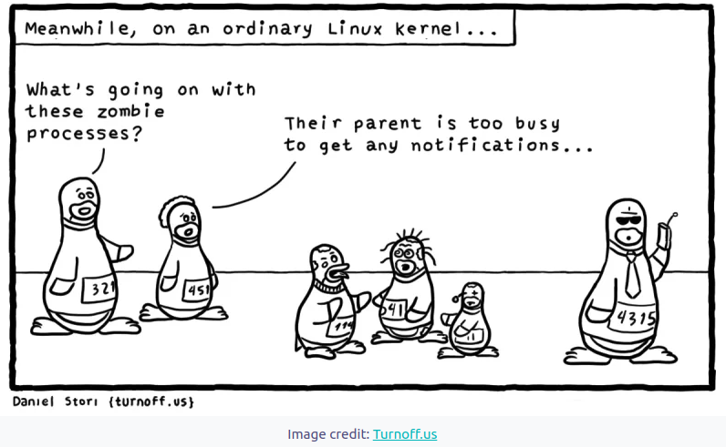

# Question 1

When a child process dies, the parent process is informed so that it can do some clean up like freeing up memory etc. However, child process goes into zombie state if the parent process is not aware of its death. For the parent, the child still exists but the child process is actually dead. This is how zombie processes (also known as defunct processes) are created and stay in the system.
An orphan process, on the other hand is a process whose parent process has died and it continues to run.

Fork system call is used for creating a new process, which is called child process, which runs concurrently with the process that makes the fork() call (parent process). After a new child process is created, both processes will execute the next instruction following the fork() system call. -A child process uses the same pc(program counter), same CPU registers, same open files which use in the parent process.

-It takes no parameters and returns an integer value.

Negative Value: creation of a child process was unsuccessful.
Zero: Returned to the newly created child process.
Positive value: Returned to parent or caller. The value contains process ID of newly created child process
